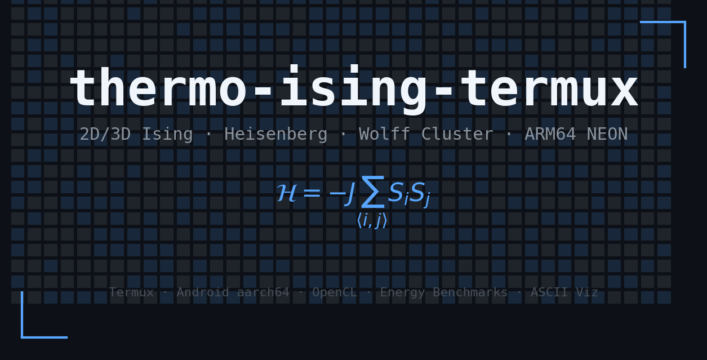
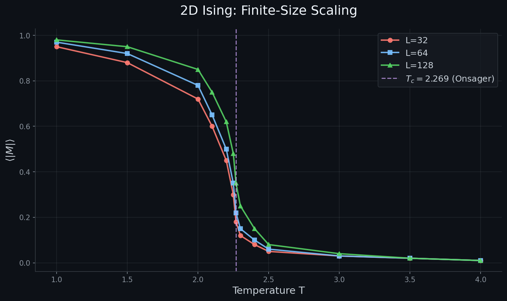
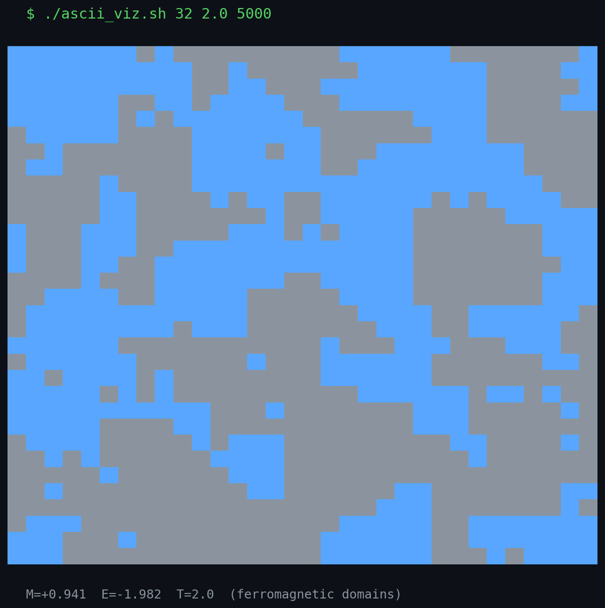

# thermo-ising-termux

<p align="center">
  
</p>

Симулятор спиновых моделей (Изинг, Гейзенберг) для Termux на Android aarch64. Оптимизирован под ARM64 NEON, с экспериментальной поддержкой OpenCL GPU.

🌐 **Живая демка:**
- [andrewrush.github.io/thermo-ising-termux/](https://andrewrush.github.io/thermo-ising-termux/) — 2D Изинг в браузере (WebGL, управление температурой в реальном времени)
- [andrewrush.github.io/thermo-ising-termux/ising_demo.html](https://andrewrush.github.io/thermo-ising-termux/ising_demo.html) — прямая ссылка на демо

> **Примечание:** GitHub показывает исходный код HTML вместо рендеринга. Используй ссылки выше (GitHub Pages) или открой файл локально: `termux-open ising_demo.html`

## Что работает

### Модели и алгоритмы

| Модель | Размерность | Алгоритм | Файл | Статус |
|---|---|---|---|---|
| 2D Изинг | 2D | Метрополис | `ising.c` | ✅ Работает |
| 2D Изинг | 2D | Вольф (кластерный) | `wolff.c` | ✅ Работает |
| 3D Изинг | 3D | Метрополис | `ising3d.c` | ✅ Работает |
| 3D Гейзенберг | 3D | Метрополис (непрерывные спины) | `heisenberg.c` | ✅ Работает |
| 2D Изинг | 2D | OpenCL checkerboard | `gpu_wrapper.c` | ⚠️ Экспериментально |

### Бенчмарки (MediaTek Helio G99, Termux)

| Модель | L | Шаги | Время | Acceptance | Модуль намагниченности | Энергия |
|---|---|---|---|---|---|---|
| 2D Изинг | 64 | 5M | 2.5 с | 24% | 0.41 | -1.43 |
| 2D Изинг (Вольф) | 64 | 100k кластеров | 12.5 с | — | 0.60 | -1.40 |
| 3D Изинг | 16 | 2M | 0.66 с | 48% | 0.27 | -1.35 |
| 3D Гейзенберг | 16 | 2M | 0.86 с | 43% | 0.32 | -1.03 |

### Энергометрика

| Модель | Шаги | Джоуль на шаг |
|---|---|---|
| 2D Изинг | 1M | 3.68 мкДж |
| 3D Изинг | 2M | 0.65 мкДж |
| Гейзенберг | 2M | 0.83 мкДж |

Измерено через `termux-battery-status` (напряжение × ток × время / шаги).

## Быстрый старт

```bash
# Сборка
make

# 2D Изинг (по умолчанию: L=64, T=2.269, 10M шагов)
./ising_app
# Ожидаемый вывод: модуль намагниченности ≈ 0.4–0.6, энергия ≈ -1.4, acceptance ≈ 20–25%

# ASCII-визуализация доменов (█ = +1, ░ = -1)
./ascii_viz.sh 32 2.0 500000
# При T=2.0 (< Tc=2.269) увидите рост магнитных доменов
# При T=3.0 (> Tc) — хаос

# Энергометрика
./benchmark_power.sh 64 1000000

# Сканирование фазового перехода
./scan_phase.sh 64 5000000
# Результат: phase_L64.csv
```

## Результаты

### Фазовый переход (скалирование при конечных размерах)

<p align="center">
  
</p>

### Визуализация магнитных доменов

<p align="center">
  
</p>

## Зачем это нужно

**Почему магнит теряет силу при нагревании?**

Магнит состоит из миллиардов микроскопических стрелочек (спинов). При низкой температуре они смотрят в одну сторону. При нагревании начинают трястись и разбегаться. Наш симулятор показывает этот момент: чёрные и серые пятна (магнитные домены) сливаются или распадаются на хаос при определённой температуре.

**Почему вода закипает ровно при 100°C, а не постепенно?**

Фазовые переходы — резкие скачки, а не плавные изменения. Вода не становится «чуть-чуть газом» — она внезапно закипает. Точно так же магнит внезапно теряет силу. Код вычисляет эту «точку невозврата» для магнитной решётки.

**Может ли телефон считать серьёзную науку?**

Да. Android — это 8-ядерный ARM64-компьютер с аппаратным генератором случайных чисел. Мы используем `/dev/urandom` (генератор случайных чисел на чипе) для инициализации симуляций — телефон буквально использует свой тепловой шум для научного эксперимента.

## WebGL-демо в браузере

Интерактивная 2D-модель Изинга с управлением температурой в реальном времени. Все вычисления выполняются на клиенте — сервер только раздаёт статику.

**Локальный запуск (без интернета):**
```bash
termux-open ising_demo.html
```

**GitHub Pages (хостинг):**

Если Pages ещё не активированы — запусти из папки проекта:
```bash
bash activate_pages.sh
```

Или вручную через браузер:
1. Открыть https://github.com/andrewrush/thermo-ising-termux/settings/pages
2. **Source:** Deploy from a branch
3. **Branch:** `main` / `/(root)`
4. Нажать **Save**

После активации демо доступно по адресу:
```
https://andrewrush.github.io/thermo-ising-termux/
```

> Демо использует WebGL и работает в любом современном браузере. Цветовая схема: оранжевый (+1) / синий (−1). Параметр L меняется корректно, T ∈ [0.5, 5.0] с шагом 0.01, Tc(2D) = 2.269. (Chrome, Firefox, Safari). Файл `ising_demo.html` — standalone (весь JS встроен inline), поэтому работает без внешних зависимостей. Корневой `index.html` автоматически перенаправляет на демо.

**Если ранее Pages работали через GitHub Actions** (старый workflow), после удаления `.github/workflows/pages.yml` деплой остановился. Скрипт `activate_pages.sh` отключит старый режим и включит branch-based deploy.

## Научный контекст: термодинамические вычисления

Этот репозиторий — программная реализация эталонной модели, которая помогает понять процессы, выполняемые термодинамическими процессорами (например, [Extropic Z1](https://extropic.ai/writing/from-one-to-one-billion)) на уровне кремния.

| | Программная реализация (этот репозиторий) | Термодинамическое железо (Extropic Z1) |
|---|---|---|
| Базовый элемент | Классический бит в оперативной памяти | Вероятностный бит (pbit) |
| Источник случайности | Генератор на чипе `/dev/urandom` + PRNG | Физический тепловой шум транзисторов |
| Сэмплирование | Алгоритмы Метрополиса / Вольфа (циклы на процессоре) | Физическая релаксация в кремнии |
| Узкое место | Стена памяти (пересылка данных в/из RAM) | Вычисление и память физически совмещены |
| Энергопотребление | ~2 Вт (CPU NEON) | < 1 Вт (термодинамический блок) |

> **Примечание:** Это сравнение архитектур, не коммерческая оценка. Мы не тестировали реальное оборудование Extropic — у нас нет доступа к Z1. Репозиторий служит математическим базлайном для понимания физики, которую такие устройства реализуют в кремнии.

## Архитектура

### 1. Энергометрика — джоули на шаг
`benchmark_power.sh` измеряет потребление батареи через `termux-battery-status` до, во время и после симуляции. Это позволяет оценить «расход топлива» алгоритмов.

### 2. Физическая энтропия
`hotstart.sh` использует `/dev/urandom` (генератор на чипе) для начального состояния. При наличии `termux-sensor` добавляет джиттер акселерометра.

### 3. ASCII-визуализация
`ising_viz.c` + `ascii_viz.sh` — Unicode-блоки █/░ показывают рост магнитных доменов в реальном времени.

### 4. Скалирование при конечных размерах
`multi_L_scan.sh` + `fss_analysis.sh` — сравнение фазовых переходов для L=32, 64, 128.

## Планы развития

- [x] 2D/3D Изинг, Гейзенберг (CPU / ARM64 NEON)
- [x] Кластерный алгоритм Вольфа
- [x] OpenCL-обёртка для GPU (checkerboard)
- [x] Бенчмарк джоулей на шаг
- [x] Инициализация через аппаратную энтропию
- [x] ASCII-визуализация доменов
- [x] Анализ скалирования при конечных размерах
- [x] WebGL-демка в браузере
- [ ] Экспорт в PPM для анимации доменов
- [ ] Гибридный CPU-GPU Вольф
- [ ] Совместимость с API energy-based моделей

## Сборка

```bash
make
```

Если OpenCL не установлен, `gpu_app` пропустится:
```bash
pkg install ocl-icd opencl-headers
```

## Запуск

```bash
# 2D Изинг
./ising_app 64 2.269 10000000

# Вольф (кластерный алгоритм, быстрее около критической точки)
./wolff_app 64 2.269 5000

# 3D Изинг
./ising3d_app 16 4.51 2000000

# Гейзенберг (непрерывные спины на сфере)
./heisenberg_app 16 1.44 2000000

# GPU (экспериментально)
./gpu_app 64 2.269 1000000

# Сравнение алгоритмов
./compare_algos.sh 64 2.269

# Полный бенчмарк
./benchmark.sh
```

## Git

```bash
git add .
git commit -m "feat: ваше сообщение"
git push
```

## Ограничения

- `termux-sensor` недоступен в Play Store-версии Termux (см. [termux-play-store#29](https://github.com/termux-play-store/termux-apps/issues/29))
- GPU OpenCL зависит от драйверов производителя; на многих устройствах недоступен из Termux
- Для L=128 и выше рекомендуется алгоритм Вольфа (Метрополис страдает от критического замедления)
